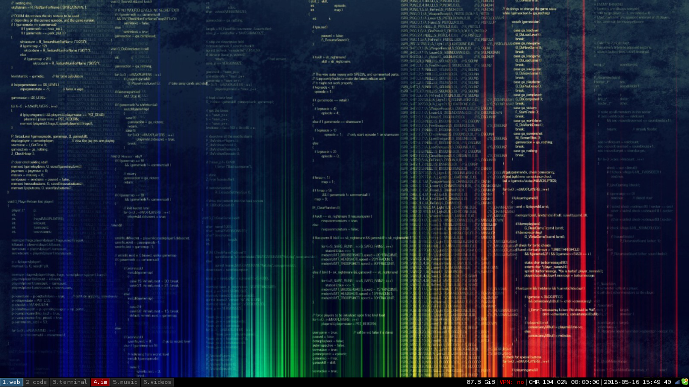
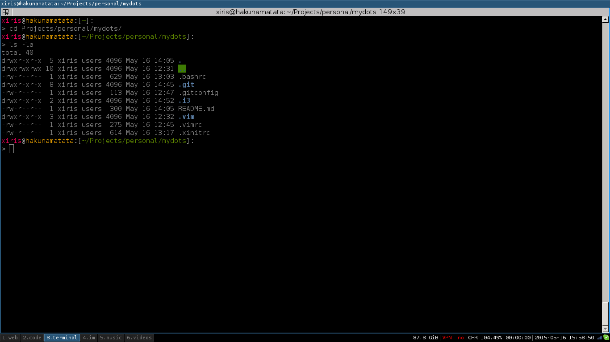
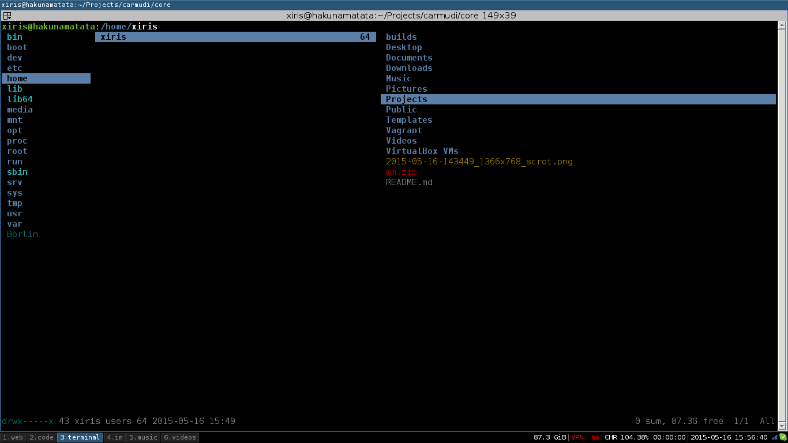
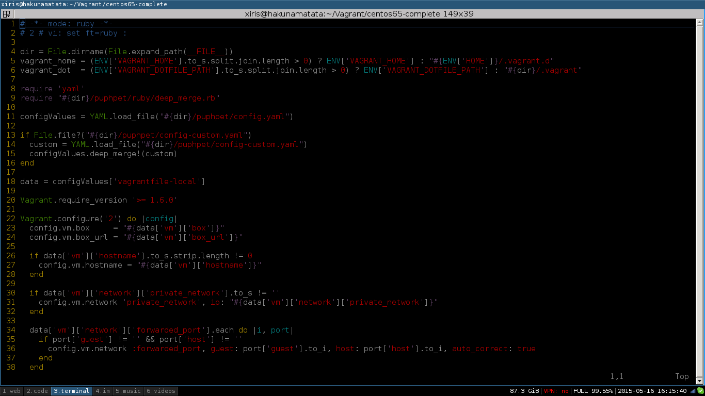

MYDOTS
======
All my config files are here to quickly setup my environments :)

* Window Manager - i3
* File Manager - Ranger
* Editor - Vim
* Terminal - Terminator
* IRC - Weechat

TODO
----

* Create script to install my preferred programs in Arch
* Create post-install script to setup everything

SCREENSHOTS
-----------

Environment Clean

Environment Terminal

Environment File Manager

Environment Editor

